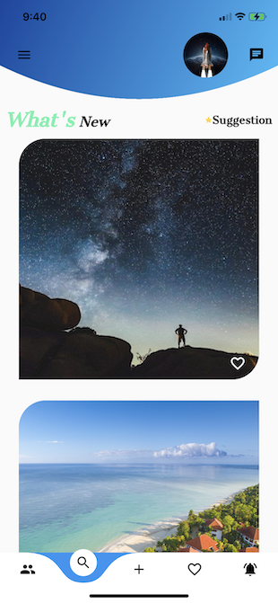
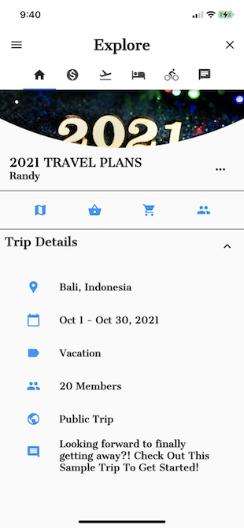
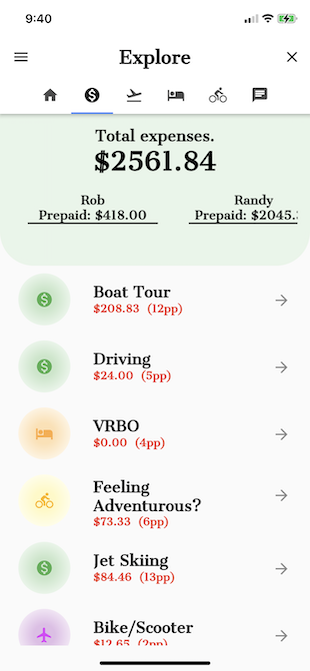
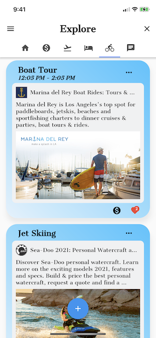
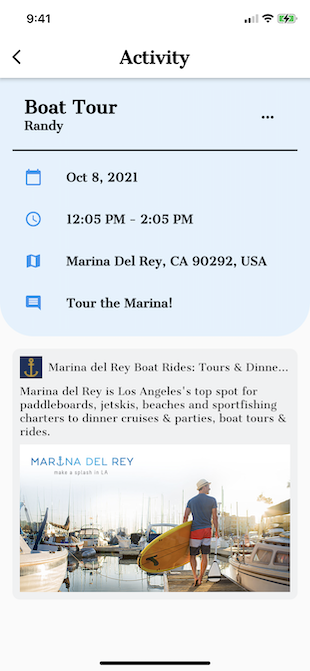
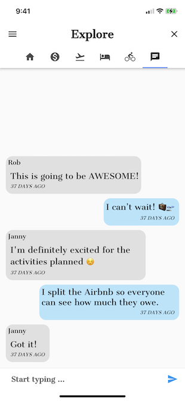

# Travel Crew

## [Check it Out!](https://www.travelcrew.app)

## What is Travel Crew
Travel Crew is a mobile app for friends to share travel plans, organize travel and even 
create full itineraries together. It is a platform that allows users to follow friends, 
view upcoming trips, vote on lodging and activities and even split expenses!

## Social Media ✨
- [Instagram](https://www.instagram.com/travelcrew_kt/)
- [Facebook](https://fb.me/TravelCrew.KT)
- [Twitter](https://twitter.com/TravelCrew_kt)

**Services we are using:**

- Firebase: [link](https://firebase.google.com)
- Google Cloud: [link](https://cloud.google.com)
- Flutter: [link](https://flutter.dev)

**Coding Styles**
- Bloc Pattern: [link](https://pub.dev/packages/bloc)

**Font**
- Cantata One [link](https://fonts.google.com/specimen/Cantata+One)

(c) 2022 Kai Technologies Corp. <Randy@kaitechcorp.com> 

This program is free software: you can redistribute it and/or modify it under the terms of the GNU General Public License as published by the Free Software Foundation, either version 3 of the License, or (at your option) any later version.

This program is distributed in the hope that it will be useful, but WITHOUT ANY WARRANTY; without even the implied warranty of MERCHANTABILITY or FITNESS FOR A PARTICULAR PURPOSE. See the GNU General Public License for more details.

You should have received a copy of the GNU General Public License along with this program. If not, see <https://www.gnu.org/licenses/>.
